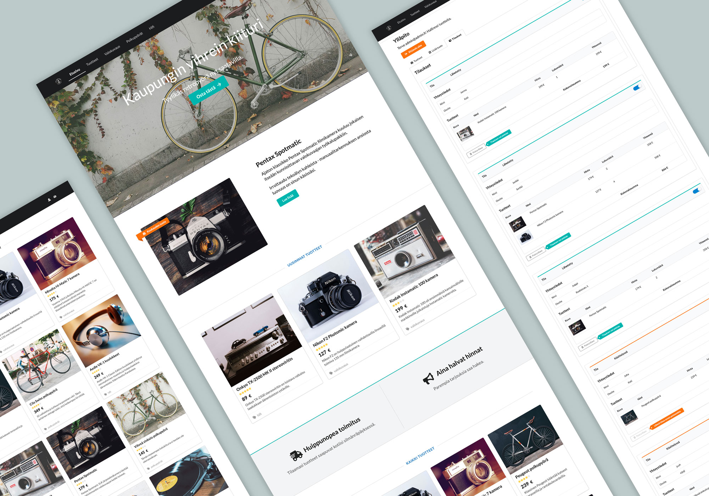

# Full Stack Websovelluskehitys - Harjoitustyö - React JS

Harjoitustyönä on toteutettu kuvitteellinen verkkokauppa ja sen ylläpitopuoli. Sivustolla on näkyvillä erilaisia tuotteita, joita asiakas voi listätä ostoskoriin ja tehdä tilauksen. Ylläpitoon voi kirjautua ja hallinnoida tuotteita sekä tilauksia.

Sovelluksen käyttöliittymä on tehty Reactilla ja tietokantana on käytössä **Firebase**. Sivuston tilanhallinta on toteutettu **Redux-storella** ja **responsiivinen** ulkoasu on tehty **Semantic UI** (React) ja **Styled components** -kirjastoja hyödyntäen. Kuvat on hankittu Unsplash-kuvapankista ja logo on tehty FreeLogoDesign-palvelussa. Tekstisisällöt ovat omaa tuotantoa. 

Sivuston kehittämisessä käytettyjä ohjelmistoja ja työkaluja ovat olleet mm. **Visual Studio Code**, GitHub Desktop, Chrome ja sen laajennukset **React Developer Tools, Redux DevTools, JSONView**. Tuotetun koodin versionhallintaan on valjastettu GitHub ja laaduntarkkailuun **Code Climate**. Backlogia on hallinnoitu Trellolla ja tuntikirjanpito on tehty Google Docs Sheetsilla.

### Sovellus

[FullStackShop (Firebase)](https://fullstackshop.firebaseapp.com/)

### Tuntikirjanpito

[Tuntikirjanpito (Google Docs)](https://docs.google.com/spreadsheets/d/10v7fwnziUzUEhIcxzUsMLEZp7PCKzS8y14R1sTwwY_0/edit?usp=sharing)

### Käyttöohjeet

[Käyttöohjeet](docs/kayttoohje.md)